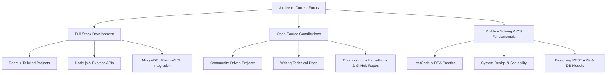

# 🚀 Jaideep Bose | Code Architect & Problem Solver

<div align="center">
  
  
  
  [](https://www.linkedin.com/in/jaideep-bose-89a93725a/)
  [](https://leetcode.com/u/Jaideep_Bose/)
  [](mailto:jaideepbose51@gmail.com)
  
</div>

---

## 🎯 About Me

```javascript
const jaideep = {
    pronouns: "He/Him",
    location: "India 🇮🇳",
    currentFocus: "Building scalable web applications",
    askMeAbout: ["Data Structures", "Algorithms", "Full Stack Development"],
    technologies: {
        backEnd: ["Node.js", "Express", "RESTful APIs"],
        frontEnd: ["React.js", "JavaScript", "HTML5", "CSS3"],
        languages: ["C++", "Java", "Python", "JavaScript"],
        databases: ["MySQL", "MongoDB", "PostgreSQL"],
        tools: ["Git", "VS Code", "Postman", "Linux"]
    },
    currentlyLearning: "System Design & Cloud Technologies",
    openToCollaborate: true,
    funFact: "I debug with console.log() and I'm proud of it! 🐛"
};
```

---

## 🛠️ Tech Arsenal

<div align="center">

### 💻 Programming Languages


### 🌐 Web Technologies


### 🛠️ Tools & Platforms


</div>

---

## 📊 GitHub Analytics

<div align="center">
  
  
</div>

<div align="center">
  
</div>

---

## 🎨 What I'm Working On

<div align="center">



</div>

---

## 💡 Fun Facts About Me

<details>
<summary>🎮 Click to reveal some fun facts!</summary>

-  I'm a night owl - best code comes after 10 PM
-  Coffee is my debugging fuel
-  I code better with earphones on
-  Linux enthusiast since college
-  I believe clean code is a love letter to your future self

</details>

---

## 🤝 Let's Connect & Collaborate!

<div align="center">

### 💬 I'm always excited to discuss:
🔹 **Data Structures & Algorithms** 🔹 **System Design** 🔹 **Open Source Projects**  
🔹 **Full Stack Development** 🔹 **Problem Solving Techniques** 🔹 **Tech Trends**

### 📫 Reach Out To Me:
[](https://www.linkedin.com/in/jaideep-bose-89a93725a/)
[](mailto:jaideepbose51@gmail.com)

---

*"A coder isn't just someone who writes instructions for machines— they're modern alchemists, turning logic into reality, one keystroke at a time."* 

</div>

<div align="center">
  
</div>

---

<div align="center">
  
</div>

### 🌟 Show some ❤️ by starring some repositories if you find them helpful!
